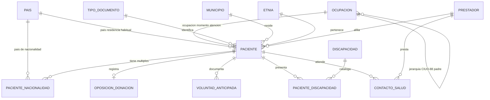

# Modelo Entidad-Relación — HCE Salud y Vida

Alineado con Resolución 866/2021 y correcciones de modelado académico.

## País de la nacionalidad (requisito expreso)

| Elemento | Tabla Django | Descripción |
|----------|--------------|-------------|
| Catálogo país | `cat_pais` | Código ISO 3166 (3) + nombre |
| Relación N:M | `pac_nacionalidad` | Un paciente → **múltiples** países de nacionalidad |
| Campo explícito en Paciente | `paises_nacionalidad` | `ManyToManyField` through `PacienteNacionalidad` |

**No** existe `codigo_nacionalidad` duplicado en `paciente`: solo la FK única `ocupacion_id` hacia CIUO-88.

## Ocupación CIUO-88 (jerarquía normativa)

| Nivel | Código | Asignable al paciente |
|-------|--------|------------------------|
| 1 Gran grupo | 1 dígito (0-9) | No |
| 2 Subgrupo mayor | 2 dígitos | No |
| 3 Subgrupo | 3 dígitos | No |
| 4 Grupo primario | 4 dígitos (agrupación) | No |
| 5 Ocupación | 4 dígitos (hoja CIUO) | **Sí** |

Auto-relación: `cat_ocupacion.padre_id` → `cat_ocupacion.codigo`

El paciente referencia **una sola** FK: `paciente.ocupacion_id` → ocupación nivel 5 (sin `id_ocupacion` ni `ocupacion_codigo` redundantes).

## Entidades principales

- **PACIENTE**: identificación y residencia
- **PACIENTE_NACIONALIDAD**: países de nacionalidad (múltiples)
- **OCUPACION**: árbol CIUO-88
- **OPOSICION_DONACION**, **VOLUNTAD_ANTICIPADA**: estructuras separadas
- **CONTACTO_SALUD**: urgencias
